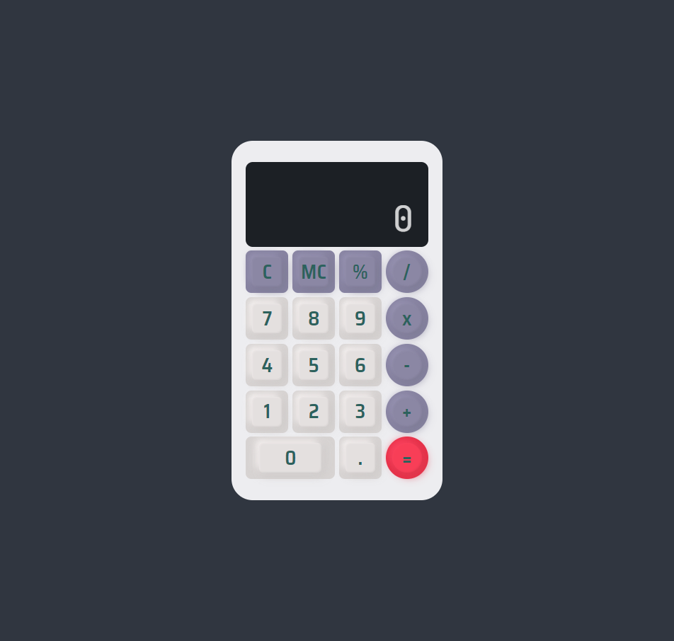

# keychron-calculator
A calculator inspired by the [MechaCalc by Afrills](https://dribbble.com/shots/15359416-MechaCalc-Calculator-App) design at Dribbble, made with Vanilla JS, HTML and CSS

It's design and color signature shares similar key points with Keychron's keyboard.

    

